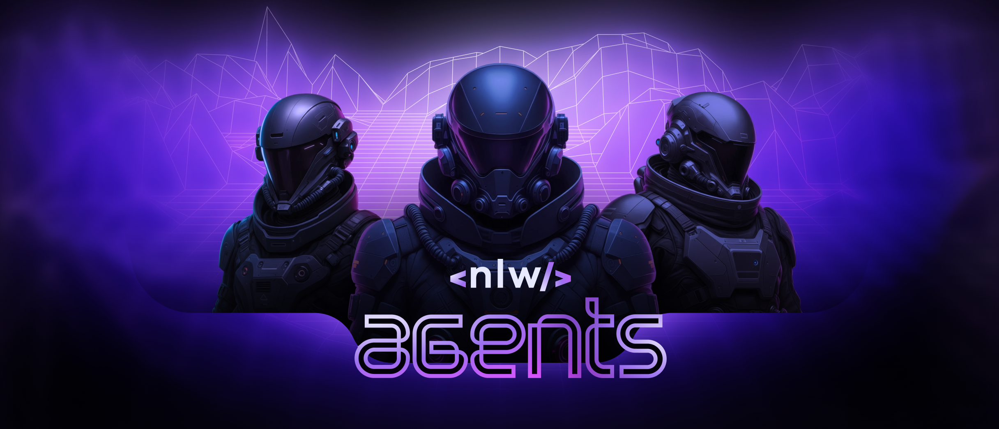

# NLW Agents Server

Uma API REST para gerenciamento de salas e perguntas com transcrição de áudio e busca semântica usando IA, construída com Node.js, Fastify e PostgreSQL.

> **Frontend**: [NLW-Agents-Web](https://github.com/SGSchneider/NLW-Agents-Web)

## 🚀 Tecnologias Utilizadas

- **Node.js** - Runtime JavaScript
- **Fastify** - Framework web rápido e eficiente
- **TypeScript** - Tipagem estática para JavaScript
- **Drizzle ORM** - ORM moderno para TypeScript
- **PostgreSQL + pgvector** - Banco de dados relacional com suporte a vetores
- **Google Gemini AI** - IA para transcrição de áudio e geração de embeddings
- **Zod** - Validação de schemas TypeScript-first
- **Biome** - Linter e formatter

## 🏗️ Arquitetura

O projeto segue uma arquitetura em camadas:

```
src/
├── db/                 # Configuração do banco de dados
│   ├── schema/         # Esquemas das tabelas (rooms, questions, audio_chunks)
│   ├── migrations/     # Migrações do banco
│   └── seed.ts         # Dados de exemplo
├── http/
│   └── routes/         # Rotas da API
├── services/
│   └── gemini.ts       # Integração com Google Gemini AI
├── env.ts              # Configuração de ambiente
└── server.ts           # Servidor principal
```

## 📋 Pré-requisitos

- Node.js 18+
- Docker e Docker Compose
- Chave de API do Google Gemini AI

## ⚙️ Setup e Configuração

### 1. Clone o repositório
```bash
git clone <url-do-repositorio>
cd server
```

### 2. Instale as dependências
```bash
npm install
```

### 3. Configure o ambiente
```bash
cp .env.example .env
```

Configure as variáveis de ambiente no arquivo `.env`. A aplicação utiliza as seguintes variáveis de ambiente:

- `PORT` - Porta do servidor (padrão: 3333)
- `DATABASE_URL` - URL de conexão com PostgreSQL
- `GOOGLE_GENAI_API_KEY` - Chave da API do Google Gemini AI

### 4. Inicie o banco de dados
```bash
docker-compose up -d
```

### 5. Execute as migrações
```bash
npm run db:migrate
```

### 6. Popule o banco com dados de exemplo
```bash
npm run db:seed
```

### 7. Inicie o servidor
```bash
# Desenvolvimento (com watch)
npm run dev

# Produção
npm start
```

## 🔌 API Endpoints

- `GET /health` - Status da aplicação
- `GET /rooms` - Lista todas as salas
- `POST /rooms` - Cria uma nova sala
- `GET /rooms/:roomId/questions` - Lista perguntas de uma sala
- `POST /rooms/:roomId/questions` - Cria uma pergunta em uma sala
- `POST /rooms/:roomId/audio` - Upload de áudio para transcrição


## 🗄️ Banco de Dados

O projeto utiliza PostgreSQL com pgvector para busca semântica:

- **rooms** - Salas de perguntas
- **questions** - Perguntas associadas às salas
- **audio_chunks** - Chunks de áudio transcritos com embeddings vetoriais

## 🤖 Funcionalidades de IA

- **Transcrição de Áudio**: Converte arquivos de áudio em texto usando Gemini AI
- **Busca Semântica**: Utiliza embeddings vetoriais para encontrar conteúdo relevante
- **Geração de Respostas**: Gera respostas contextualizadas baseadas nas transcrições

## 📝 Scripts Disponíveis

```bash
npm run dev          # Inicia em modo desenvolvimento
npm start            # Inicia em modo produção
npm run db:generate  # Gera migrações
npm run db:migrate   # Executa migrações
npm run db:seed      # Popula banco com dados de exemplo
```

## 🔧 Desenvolvimento

O projeto utiliza:
- **Experimental TypeScript support** do Node.js
- **Snake case** para colunas do banco
- **Zod** para validação de entrada
- **Biome** para formatação e linting de código
- **Busca por similaridade** utilizando pgvector